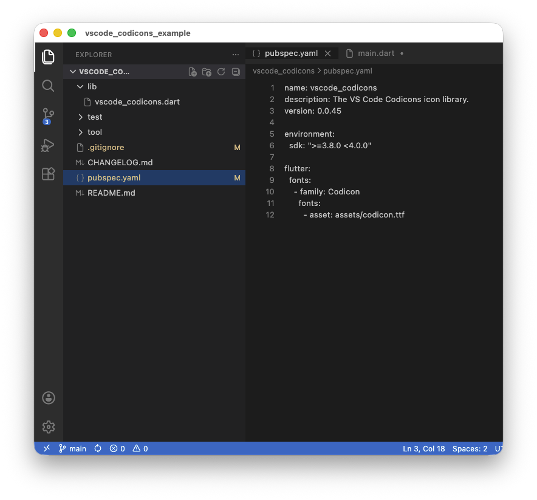

# vscode_codicons example

A tiny Flutter app that rebuilds the **VS Code** window chrome — activity bar,
Explorer, editor tabs, and status bar — using only [`vscode_codicons`][pkg]
glyphs. It is UI only (no interaction), meant to show the icons in a familiar
layout.



```bash
cd example
flutter run   # -d macos / -d chrome / a booted simulator
```

The whole UI lives in [`lib/main.dart`](lib/main.dart). Usage is just:

```dart
import 'package:vscode_codicons/vscode_codicons.dart';

const Icon(Codicons.sourceControl, size: 24);
```

[pkg]: https://pub.dev/packages/vscode_codicons
